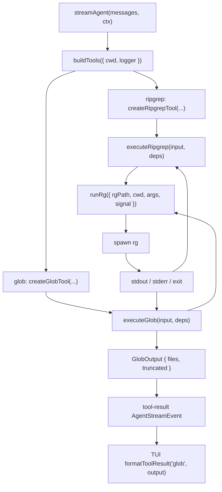

<!-- markdownlint-disable MD060 -->

# Glob Tool — Spec

本文档描述 lordcode 接入第二个 agent tool：**glob 文件路径匹配**。它用于让模型在回答或改代码前快速列出符合路径模式的文件，例如 `**/*.ts`、`packages/server/**/*.test.ts`。

本设计基于现有 `ripgrep` tool，不重新设计 tool framework。核心选择是：glob 复用 `@vscode/ripgrep` 提供的跨平台 `rg` 二进制，通过 `rg --files -g <pattern>` 实现文件列举，并把现有 ripgrep 执行层里的 spawn / abort / stderr / exit-code 处理抽成共享 helper。

---

## 1. 概述

现有 `ripgrep` tool 已经完成了 agent tool 的端到端链路：

- `streamAgent` 每 turn 构建 tools 并传给 Vercel AI SDK `streamText`。
- SDK 执行 tool 后，通过 `tool-call` / `tool-result` / `tool-error` chunk 回传。
- server 将 tool chunk 翻译为 `AgentStreamEvent`。
- TUI 以简短单行展示 tool 调用与结果。

因此 glob tool 只需要补齐一个新的具体 tool，并小幅扩展 registry / TUI 格式化。它不改变 agent loop、SSE 协议、shared API 类型或配置文件。

---

## 2. 目标 & 范围

### In Scope

- 新增 `glob` tool，提供按 glob 模式列出文件路径的能力。
- 使用现有 `@vscode/ripgrep` 依赖，不引入新的 glob 库。
- 从 `ripgrep/execute.ts` 抽取共享的 `runRg` helper，供 `executeRipgrep` 与 `executeGlob` 共用。
- `executeGlob(input, deps)`：spawn `rg --files --no-config -g <pattern>` → 解析 stdout 行 → 截断 → 返回结构化输出。
- `createGlobTool(deps)`：把 `executeGlob` 包成 Vercel AI SDK `tool({ inputSchema, outputSchema, execute })`。
- `buildTools(deps)` 注册 `{ ripgrep, glob }`。
- TUI 最小渲染：`glob(pattern: "**/*.ts")` / `12 files` / `glob failed: <msg>`。
- abort 链路与 ripgrep 一致：HTTP signal → `streamAgent` → SDK tool execute → `rg` 子进程 `SIGTERM`。
- 单元测试覆盖 schema、参数构造、真实 fixture、错误、abort、registry、TUI 格式化。

### Out of Scope

- 不新增 tool permission / approval。
- 不新增 config 开关；glob 默认启用。
- 不新增路径沙箱；与现有 ripgrep tool 一样，`path` 由模型传入，执行 cwd 仍来自 server turn。
- 不实现自研 glob walker。
- 不支持流式返回文件列表；结果作为单个 `tool-result` 下发。
- 不改变 `AgentStreamEvent` wire format。
- 不做可展开 tool 详情面板。
- 不做缓存；每次调用都是真 spawn。

---

## 3. 关键设计决策

| # | 决策 | 选择 | 理由 |
| --- | --- | --- | --- |
| 1 | glob 实现方式 | 使用 `rg --files -g <pattern>` | 与现有 ripgrep tool 共用二进制、忽略规则、跨平台行为；避免引入第二套文件遍历语义。 |
| 2 | 是否直接复用 `executeRipgrep` | 不直接复用 | `executeRipgrep` 跑 `rg --json <content-regex>` 并解析 JSON Lines；glob 跑 `rg --files` 并解析纯路径行，输入语义和输出形状不同。 |
| 3 | 复用粒度 | 抽取共享 `runRg` helper | 复用真正通用的 spawn、stdout/stderr 收集、abort、exit-code、日志处理，同时保留两个 tool 的清晰语义。 |
| 4 | 新依赖 | 不新增依赖 | `@vscode/ripgrep` 已存在，且能满足 glob 文件列举需求。 |
| 5 | 输出形态 | `{ files, truncated }` | 简洁、LLM 友好、与 ripgrep 的 truncation 模式一致。 |
| 6 | exit code 映射 | `0`/`1` 正常，`2+` 抛错 | `rg --files` 无匹配时 exit code 为 `1`，不是执行错误。 |
| 7 | hidden 文件 | 暴露 `includeHidden`，默认 `false`；默认输出过滤 hidden 路径段 | `rg --files -g <pattern>` 会因显式 glob 带出 hidden 路径，输出层需补一道过滤；需要查点文件时模型可以显式打开。 |
| 8 | 忽略规则 | 默认尊重 `.gitignore` / ignore 文件 | 与 `rg` 默认行为一致，减少扫描噪音；本迭代不暴露 `--no-ignore`。 |
| 9 | 截断 | execute 内按 `headLimit` 截断并返回 `truncated` | 控制 token 体积，并给模型继续细化查询的信号。 |
| 10 | TUI | 只做单行摘要 | 与现有 tool 展示保持一致，避免提前做复杂 UI。 |

---

## 4. 架构总览



目标文件结构：

```text
packages/server/src/tools/
  process.ts                 # new: shared runRg helper
  registry.ts                # add glob registration
  index.ts                   # export glob types/functions
  ripgrep/
    execute.ts               # refactor to call runRg
    ...
  glob/
    schema.ts                # new
    execute.ts               # new
    tool.ts                  # new
    execute.test.ts          # new
    schema.test.ts           # optional if schema cases grow

packages/server/tests/fixtures/
  glob-corpus/               # new fixture tree for real rg --files tests

packages/tui/src/lib/
  format-tool-call.ts        # add glob-specific formatting
  format-tool-call.test.ts   # add glob cases
```

---

## 5. 暴露的接口

### 5.1 Tool 输入 schema — `GlobInput`

落在 `packages/server/src/tools/glob/schema.ts`：

```typescript
import { z } from "zod";

export const GlobInputSchema = z.object({
  pattern: z
    .string()
    .min(1)
    .describe(
      "Glob pattern for file paths, e.g. '**/*.ts' or 'packages/server/**/*.test.ts'.",
    ),

  path: z
    .string()
    .optional()
    .describe(
      "Directory or file to list under. Relative to the workspace root. Defaults to the workspace root.",
    ),

  exclude: z
    .array(z.string().min(1))
    .max(20)
    .default([])
    .describe(
      "Additional glob patterns to exclude. Do not prefix with '!'; the tool maps each item to a negated ripgrep glob.",
    ),

  includeHidden: z
    .boolean()
    .default(false)
    .describe("Include hidden files and directories by passing rg --hidden."),

  headLimit: z
    .number()
    .int()
    .positive()
    .max(1000)
    .default(100)
    .describe("Maximum number of file paths to return. Default 100, hard cap 1000."),
});

export type GlobInput = z.infer<typeof GlobInputSchema>;
```

### 5.2 Tool 输出 schema — `GlobOutput`

```typescript
export const GlobOutputSchema = z.object({
  files: z.array(z.string()).describe("Matched file paths relative to cwd."),
  truncated: z.boolean().describe("True when more matches existed beyond headLimit."),
});

export type GlobOutput = z.infer<typeof GlobOutputSchema>;
```

### 5.3 Tool description

```text
List files by glob pattern using ripgrep's file traversal. Use this when you need
to discover files by path, extension, package, or test naming convention before
reading or searching file contents.

Examples:
- pattern: "**/*.ts"
- pattern: "packages/server/**/*.test.ts"
- pattern: "**/*.{ts,tsx}", exclude: ["**/node_modules/**", "**/dist/**"]

This tool returns file paths only. Use ripgrep when you need to search inside
files.
```

---

## 6. 共享 `runRg` Helper

新增 `packages/server/src/tools/process.ts`：

```typescript
import type { ChildProcess, spawn as defaultSpawn } from "node:child_process";
import type { Logger } from "@lordcode/logger";

export interface RunRgInput {
  rgPath: string;
  cwd: string;
  args: string[];
  logger?: Logger;
  signal?: AbortSignal;
  spawn?: typeof defaultSpawn;
}

export interface RunRgResult {
  stdout: string;
  stderr: string;
  exitCode: number | null;
  signalName: NodeJS.Signals | null;
  elapsedMs: number;
}

export class RgProcessError extends Error {
  constructor(
    message: string,
    public readonly cause: {
      exitCode?: number;
      stderr?: string;
      spawnError?: unknown;
      signalName?: NodeJS.Signals | null;
    },
  );
}

export async function runRg(input: RunRgInput): Promise<RunRgResult>;
```

`runRg` 的责任：

- 执行 `spawn(rgPath, args, { cwd, stdio: ["ignore", "pipe", "pipe"] })`。
- 收集 stdout / stderr 为字符串。
- 监听 `AbortSignal`，abort 时向子进程发送 `SIGTERM`。
- abort 后抛 `AbortError`。
- spawn 失败或运行时 `error` 抛 `RgProcessError`。
- 记录 `args`、`cwd`、`exitCode`、`elapsedMs`。

`runRg` 不理解 `rg` 的业务 exit code：它只返回 `exitCode`。`executeRipgrep` 与 `executeGlob` 分别决定 `0` / `1` / `2+` 如何映射。

---

## 7. `executeGlob`

落在 `packages/server/src/tools/glob/execute.ts`：

```typescript
export interface GlobDeps {
  rgPath: string;
  cwd: string;
  logger?: Logger;
  signal?: AbortSignal;
  spawn?: typeof import("node:child_process").spawn;
}

export class GlobError extends Error {
  constructor(
    message: string,
    public readonly cause: { exitCode?: number; stderr?: string; spawnError?: unknown },
  );
}

export async function executeGlob(
  input: GlobInput,
  deps: GlobDeps,
): Promise<GlobOutput>;

export function buildArgs(input: GlobInput): string[];
```

### Args

`buildArgs(input)` 输出：

```text
--files
--no-config
-g <input.pattern>
[-g !<exclude[0]>]
[-g !<exclude[1]>]
[--hidden]
[input.path]
```

注意：

- `exclude` schema 不要求调用方写 `!`，实现统一加 `!`，避免模型混用两种写法。
- `path` 放在最后，保持与现有 ripgrep `buildArgs` 风格一致。
- 不暴露 `--no-ignore`。

### Output parsing

`rg --files` stdout 是换行分隔的路径列表。实现只需要：

1. `stdout.split(/\r?\n/)`
2. 去掉空行
3. 当 `includeHidden: false` 时过滤任意以 `.` 开头的路径段
4. 取前 `headLimit`
5. 如果过滤后的文件数大于 `headLimit`，`truncated: true`

### Exit code

| exitCode | 行为 |
| --- | --- |
| `0` | 正常解析 stdout |
| `1` | 返回 `{ files: [], truncated: false }` |
| `2+` | 抛 `GlobError("glob failed ...")` |
| `null` | 如果不是 abort，抛 `GlobError("glob terminated ...")` |

---

## 8. SDK Tool 适配层

落在 `packages/server/src/tools/glob/tool.ts`：

```typescript
import { tool } from "ai";
import { executeGlob, type GlobDeps } from "./execute.js";
import { GLOB_TOOL_DESCRIPTION, GlobInputSchema, GlobOutputSchema } from "./schema.js";

export function createGlobTool(deps: Omit<GlobDeps, "signal">) {
  return tool({
    description: GLOB_TOOL_DESCRIPTION,
    inputSchema: GlobInputSchema,
    outputSchema: GlobOutputSchema,
    execute: async (input, { abortSignal }) =>
      executeGlob(input, {
        ...deps,
        ...(abortSignal ? { signal: abortSignal } : {}),
      }),
  });
}
```

---

## 9. Registry & Exports

`packages/server/src/tools/registry.ts`：

```typescript
export function buildTools(deps: ToolDeps) {
  return {
    ripgrep: createRipgrepTool({
      rgPath,
      cwd: deps.cwd,
      ...(deps.logger ? { logger: deps.logger.child("ripgrep") } : {}),
    }),
    glob: createGlobTool({
      rgPath,
      cwd: deps.cwd,
      ...(deps.logger ? { logger: deps.logger.child("glob") } : {}),
    }),
  };
}
```

`packages/server/src/tools/index.ts` 继续作为公共 barrel，新增 glob schema / execute / tool exports。

---

## 10. TUI 渲染

`packages/tui/src/lib/format-tool-call.ts` 增加 glob 分支。

Tool call ordering：

```typescript
const order =
  toolName === "ripgrep"
    ? ["pattern", "path", "type", "glob", "outputMode", "headLimit"]
    : toolName === "glob"
      ? ["pattern", "path", "exclude", "includeHidden", "headLimit"]
      : Object.keys(input);
```

默认值省略：

- `headLimit: 100`
- `includeHidden: false`
- `exclude: []`

Tool result：

```typescript
function formatGlobResult(output: unknown): string {
  if (!isRecord(output)) return safePreview(output);
  const files = Array.isArray(output.files) ? output.files : [];
  const suffix = output.truncated === true ? " (truncated)" : "";
  return `${files.length} file${files.length === 1 ? "" : "s"}${suffix}`;
}
```

---

## 11. 错误处理

- Schema 校验失败：由 AI SDK / Zod 处理为 tool error。
- spawn 失败：`runRg` 抛 `RgProcessError`，`executeGlob` 包装为 `GlobError`。
- `rg` exit code `2+`：`executeGlob` 抛 `GlobError`，message 包含 stderr 摘要。
- abort：抛 `AbortError`，沿用现有 agent abort 行为，不额外产生正常 `tool-result`。
- 无匹配：不是错误，返回空 `files`。

---

## 12. Non-functional Requirements

### Performance

- 默认 `headLimit = 100`，硬上限 `1000`，控制返回 payload。
- 使用 `rg --files`，遍历性能与 ripgrep tool 一致。
- 不缓存，避免 stale file list。

### Security

- tool 只读，不修改文件。
- 不执行 shell；使用 `spawn(rgPath, args)` 参数数组，避免 shell injection。
- 本迭代不新增路径沙箱，与现有 ripgrep tool 保持一致。

### Reliability

- abort 会终止子进程，避免悬挂。
- exit code `1` 明确视为无匹配，避免把正常空结果当错误。
- 共享 `runRg` 后，ripgrep 和 glob 的进程生命周期行为一致。

### Observability

- 日志通道：`server:agent:stream:tool:glob`。
- 记录 args、cwd、exitCode、elapsedMs、truncated。
- 错误日志包含 stderr 摘要，但不额外打印文件内容。

### Compatibility

- 不改变 shared API。
- 不改变 `streamAgent` 的 tool event handling。
- 不改变用户 config。
- `ripgrep` tool 的对外 schema 和输出保持兼容。

---

## 13. Unit Test Strategy

### UT-1 Schema

- Given 缺省 optional 字段，When 解析最小输入 `{ pattern: "**/*.ts" }`，Then 得到默认 `exclude: []`、`includeHidden: false`、`headLimit: 100`。
- Given 空 pattern，When 解析，Then schema 拒绝。
- Given `headLimit > 1000`，When 解析，Then schema 拒绝。
- Given `exclude` 超过 20 项，When 解析，Then schema 拒绝。

### UT-2 `buildArgs`

- Given 最小输入，When build args，Then 输出 `["--files", "--no-config", "-g", pattern]`。
- Given `path`，Then `path` 追加在末尾。
- Given `exclude: ["**/dist/**"]`，Then 输出 `-g "!**/dist/**"`。
- Given `includeHidden: true`，Then 包含 `--hidden`。
- Given `includeHidden: false`，Then 不包含 `--hidden`。

### UT-3 `runRg`

- Given fake spawn 返回 stdout/stderr/exitCode，When `runRg` 执行，Then 返回完整 stdout/stderr/exit metadata。
- Given spawn throw，When `runRg` 执行，Then 抛 `RgProcessError`。
- Given AbortSignal before spawn，When `runRg` 执行，Then 抛 `AbortError`。
- Given AbortSignal during process，When signal abort，Then child receives `SIGTERM` and `runRg` rejects with `AbortError`。

### UT-4 `executeGlob`

- Given fixture tree，When pattern 匹配 `**/*.ts`，Then 返回相对路径列表。
- Given 无匹配 pattern，When `rg` exit code 为 `1`，Then 返回空列表而不是抛错。
- Given `headLimit` 小于匹配数量，Then 文件数被截断且 `truncated: true`。
- Given `exclude`，Then 被排除路径不出现。
- Given `includeHidden: false`，Then hidden file 不出现。
- Given `includeHidden: true`，Then hidden file 可以出现。
- Given `rg` exit code `2`，Then 抛 `GlobError`。

### UT-5 Ripgrep Regression

- Given 现有 ripgrep fixture，When `executeRipgrep` 走抽取后的 `runRg`，Then 现有 ripgrep execute/parse 行为保持不变。
- Given ripgrep abort 测试，When signal abort，Then 仍抛 `AbortError`。
- Given ripgrep no-match，When exit code `1`，Then 仍返回空 payload。

### UT-6 Registry

- Given `buildTools({ cwd })`，When 读取返回对象，Then 包含 `ripgrep` 和 `glob`。
- Given logger，When build tools，Then glob logger 使用 child channel `glob`。

### UT-7 TUI Formatting

- Given glob tool call with default values，When format，Then 显示 `glob(pattern: "...")` 并省略默认值。
- Given glob result with 1 file，Then 显示 `1 file`。
- Given glob result with multiple files，Then 显示 `N files`。
- Given truncated result，Then 追加 `(truncated)`。
- Given malformed output，Then fallback 到 safe preview。

---

## 14. E2E Strategy

`EXEMPT`

理由：本迭代不新增外部 route、不改变 SSE wire format、不新增交互式 UI 面板。用户可见行为通过现有 agent tool event 通道表现，核心风险集中在 server tool 执行与 TUI 单行格式化，使用单元测试和真实 fixture integration tests 覆盖即可。

---

## 15. Open Questions

本 spec 按当前讨论做如下假设：

- glob 默认尊重 `.gitignore`，不暴露 `noIgnore`。
- glob 可以暴露 `includeHidden`，但默认关闭。
- `exclude` 输入不要求用户写 `!`，由实现统一转换为 ripgrep negated glob。
- `runRg` 抽取时允许轻微重构 `executeRipgrep`，但不改变其 schema、输出与测试期望。
