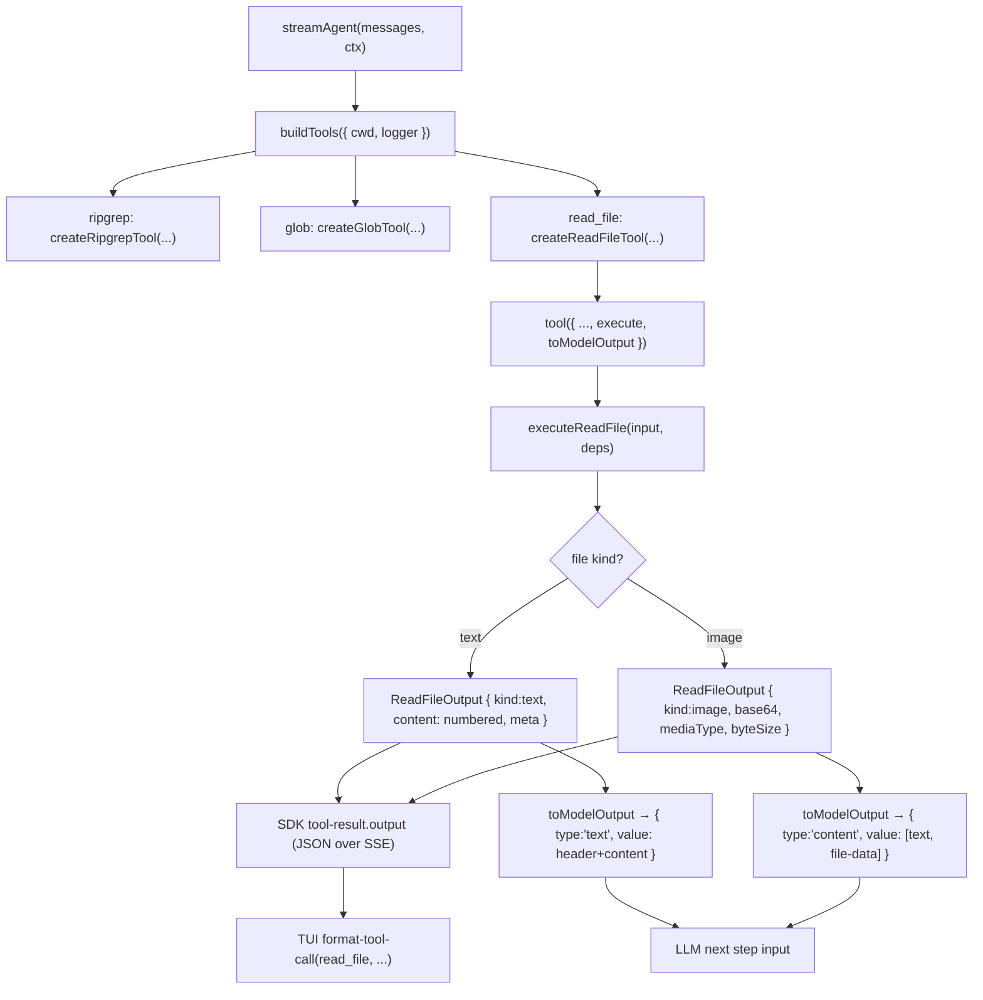

<!-- markdownlint-disable MD060 -->

# Read File Tool — Spec

本文档描述 lordcode 接入第三个 agent tool：**read_file 文件内容读取**。它给模型直接打开一个文件并按行号查看内容的能力（文本），以及把支持的图片文件以 multimodal 形式喂进模型上下文的能力（image）。

本设计基于现有 `ripgrep` / `glob` 两个 tool 已经落地的 framework，不重新设计 tool 框架。核心新增点：

- 用 Node `node:fs/promises` 直接读盘，不走 `runRg` 子进程通道。
- 输出 schema 是 `kind: "text" | "image"` 的 discriminated union。
- 用 AI SDK 6 的 `toModelOutput` 钩子，把 `kind: "image"` 翻译成 SDK 的 `{type:'content', value:[{type:'file-data', ...}]}`，让 vision 模型真正"看到"图。
- SSE wire format / shared API 不变；TUI 端继续按 `output: unknown` 渲染单行摘要。

---

## 1. 概述

到本迭代之前，lordcode 已经有：

- `ripgrep`（[docs/spec/ripgrep-tool/design.md](../ripgrep-tool/design.md)）：按内容搜代码。
- `glob`（[docs/spec/glob-tool/design.md](../glob-tool/design.md)）：按路径列文件。

模型在做大多数任务时还差最关键的一步——**打开某个文件看里面写了什么**。这一步用 `ripgrep` 做不到（拿不到完整上下文），用 `glob` 也做不到（只给路径）。`read_file` 补齐这个缺口。

实现上沿用 ripgrep / glob 的三层结构（`schema.ts` + `execute.ts` + `tool.ts`），register 到现有 `buildTools`，TUI 端在 `format-tool-call.ts` 加一组渲染分支。最大的两个特殊性都集中在 `tool.ts`：

1. 提供 `toModelOutput`，把我们内部 JSON-friendly 的 `ReadFileOutput` 翻译成 SDK 的 `ToolResultOutput`。
2. 这让 `image` 文件可以走 multimodal 路径，而 `text` 文件保持原来的 JSON 路径（但在 toModelOutput 里把元数据 + 带行号正文拼成单条 `text`，让模型读起来直接、不用先 JSON.parse）。

---

## 2. 目标 & 范围

### In Scope

- 新增 `read_file` tool，支持按 `path` / `offset` / `limit` 读取本地文件。
- 文本：返回带行号前缀的 `content` 字符串 + `startLine` / `endLine` / `totalLines` / `truncated` / `lineTruncated` 元数据。
- 图片：识别 PNG / JPEG / GIF / WEBP 四种常见格式，返回 `base64` + `mediaType` + `byteSize`。
- `toModelOutput`：image 走 SDK 的 `content` 多 part 路径（含 `file-data`），text 走 SDK 的 `text` 路径但把元数据拼进字符串。
- `buildTools(deps)` 注册 `{ ripgrep, glob, read_file }`。
- TUI 最小渲染：`read_file(path: "...", offset: 10, limit: 100)` / `← 100 lines (10-109 of 234) truncated` / `← image (12.3 KB, image/png)` / `× read_file failed: ENOENT: ...`。
- abort 链路：HTTP signal → `streamAgent` → SDK tool execute → `fs.readFile` 的 `AbortSignal` 取消（Node ≥ 17）。
- 单元测试覆盖 schema、执行（真 fixture）、`toModelOutput` 转换、TUI 格式化、registry。
- 新 spec 落 `docs/spec/read-file-tool/design.md`（本文件）。

### Out of Scope

- PDF / audio / video / Office 文档解析。
- `.ipynb` 特殊渲染（按 JSON 文本读，受 `MAX_TEXT_BYTES` / `limit` 约束）。
- 负 `offset`（"从末尾倒数 N 行"）。
- Streaming-by-line 大文件读取（超过 `MAX_TEXT_BYTES` 直接拒）。
- 写文件 / edit 文件 / patch 文件（完全不同的 tool）。
- 路径沙箱（与 ripgrep / glob 一致，由用户对自己 agent 的信任负责）。
- 跨 turn / 跨 call 缓存。
- AgentStreamEvent wire format 扩展（image 走 `toModelOutput` 内化）。
- 用户审批（与现有 tool 一致，默认开启）。

---

## 3. 关键设计决策

| #  | 决策                                         | 选择                                                                                          | 理由                                                                                                          |
| -- | -------------------------------------------- | --------------------------------------------------------------------------------------------- | ------------------------------------------------------------------------------------------------------------- |
| 1  | 实现方式                                     | Node `node:fs/promises`                                                                       | 比走子进程 / 自实现 stream 简单一个数量级，单元测试也容易。`fs.readFile` 在 Node ≥ 17 支持 `AbortSignal`。     |
| 2  | 文件大小上限                                 | text 10MB，image 5MB                                                                            | 内存 / token 预算；超过上限抛 `TOO_LARGE` 让模型换策略（例如改用 `ripgrep` 定位再 `read_file` 切片）。         |
| 3  | 行截断字符上限                               | `MAX_LINE_CHARS = 2000`，超长行以 `…` 收尾并设 `lineTruncated: true`                          | 防 minified JS / 一行 1MB 的日志撑爆 token 预算。                                                              |
| 4  | 默认 limit                                   | `2000` 行，硬上限 `10000`                                                                       | 与 Claude Code Read tool 默认值一致；够看一个中等模块全文。                                                    |
| 5  | offset 语义                                  | 1-indexed；缺省 1；不支持负数                                                                  | LLM 引用代码用 1-indexed 是行业标准；负数语义"末尾倒数"在 MVP 没有强烈需求。                                  |
| 6  | 返回行号形态                                 | content 字段是带行号前缀的字符串 `"     N\|<line>\n"`，行号右对齐 6 字符                          | LLM 直接读、直接引用具体行；与 Cursor / Claude Code Read tool 风格一致；省去客户端拼接。                       |
| 7  | 输出形状                                     | discriminated union by `kind: "text" \| "image"`                                              | 同一 tool 出两类内容，未来加 PDF / audio 也能扩 union；与 ripgrep 的 `mode` discriminator 同款套路。           |
| 8  | image 怎么喂给模型                           | `toModelOutput` 返回 `{type:'content', value:[{type:'text'}, {type:'file-data', data, mediaType}]}` | AI SDK 6 已经支持；不需要扩展 `AgentStreamEvent`；vision 模型能直接看图。                                       |
| 9  | text 也走 `toModelOutput`                    | 把 header + content 拼成单个 `{type:'text', value: ...}`                                       | 默认 JSON 序列化会把 `content` 变成带 `\\n` 转义的 JSON 字符串，token 浪费且模型不易引用行号；自己拼更友好。  |
| 10 | image base64 是否进 SSE                      | 进                                                                                            | TUI 也能拿到 mediaType / byteSize 渲染摘要；多读盘一次只为干净有点过；本地 socket 几 MB 可接受。                |
| 11 | image 格式范围                               | PNG / JPEG / GIF / WEBP 四种                                                                  | provider vision API 普遍支持；扩展名 + magic bytes 双判，避免被改名诱导。                                       |
| 12 | binary 检测                                  | 前 8KB 含 `0x00` 字节即认定 binary，抛 `BINARY`                                                | 简单可靠，与 git / less 等工具一致；未通过 image 分支且检测到 binary 的文件直接拒。                            |
| 13 | 路径解析                                     | `path.resolve(deps.cwd, input.path)`；相对 / 绝对统一处理                                       | 与现有 ripgrep / glob 把 `path` 透传给 rg 的语义保持兼容（rg 也是相对 cwd），同时允许绝对路径。                |
| 14 | 返回的 path 字段                             | 绝对路径                                                                                       | LLM 后续在 prompt / message 里引用文件位置更稳，不会因为 cwd 变化产生歧义。                                    |
| 15 | tool 命名                                    | `read_file` (snake_case)                                                                       | OpenAI / Anthropic tool naming convention 是 snake_case，模型最熟；ripgrep / glob 是单词所以不显，本工具是两词。 |
| 16 | abort                                        | 把 `abortSignal` 传给 `fs.readFile({ signal })`                                                | Node 自带 `AbortError`，沿用现有 ripgrep `runRg` 的 abort 语义（SDK 不发 `tool-result`，整流自然终止）。       |
| 17 | 跨 fixture 测试套路                          | 沿用 ripgrep `tests/fixtures/ripgrep-corpus/` 模式，新增 `read-file-corpus/`                    | 真实 fs 行为最稳；单元测试不需要 mock fs。                                                                     |

---

## 4. 架构总览



目标文件结构（仅列新增 / 修改部分）：

```text
packages/server/src/tools/
  registry.ts                # add read_file registration
  index.ts                   # export read_file types/functions
  read-file/
    schema.ts                # new
    execute.ts               # new
    tool.ts                  # new
    execute.test.ts          # new
    tool.test.ts             # new

packages/server/tests/fixtures/
  read-file-corpus/          # new fixture tree
    small.txt
    multiline.ts
    long-line.txt
    binary.bin
    image.png

packages/tui/src/lib/
  format-tool-call.ts        # add read_file branches
  format-tool-call.test.ts   # add read_file cases

docs/spec/
  read-file-tool/design.md   # this file
```

---

## 5. 暴露的接口

### 5.1 Tool 输入 schema — `ReadFileInput`

落在 `packages/server/src/tools/read-file/schema.ts`：

```typescript
import { z } from "zod";

export const ReadFileInputSchema = z.object({
  path: z
    .string()
    .min(1)
    .describe(
      "File path to read. Relative paths are resolved against the workspace root; absolute paths are used as-is.",
    ),

  offset: z
    .number()
    .int()
    .positive()
    .optional()
    .describe(
      "1-indexed start line. Defaults to 1. Use together with `limit` to page through large files.",
    ),

  limit: z
    .number()
    .int()
    .positive()
    .max(10000)
    .optional()
    .describe(
      "Maximum number of lines to return starting at `offset`. Defaults to 2000. Hard cap 10000.",
    ),
});

export type ReadFileInput = z.infer<typeof ReadFileInputSchema>;
```

不暴露给 LLM 的字段（避免出错面与模型负担）：编码（永远 UTF-8）、binary 模式开关、负偏移、行截断阈值。

### 5.2 Tool 输出 schema — `ReadFileOutput`

```typescript
const TextOutputSchema = z.object({
  kind: z.literal("text"),
  path: z.string().describe("Absolute path of the file that was read."),
  content: z
    .string()
    .describe(
      "Line-numbered content. Each line is prefixed with right-aligned 6-char line number then `|`, then the line text. Trailing newline preserved.",
    ),
  startLine: z.number().int().positive(),
  endLine: z
    .number()
    .int()
    .nonnegative()
    .describe("Inclusive end line. Equals `startLine - 1` when the window is empty."),
  totalLines: z.number().int().nonnegative(),
  truncated: z
    .boolean()
    .describe("True when `endLine < totalLines`, i.e. more lines exist beyond the window."),
  lineTruncated: z
    .boolean()
    .describe("True when at least one returned line was clipped to `MAX_LINE_CHARS`."),
});

const ImageOutputSchema = z.object({
  kind: z.literal("image"),
  path: z.string(),
  mediaType: z.enum(["image/png", "image/jpeg", "image/gif", "image/webp"]),
  byteSize: z.number().int().nonnegative(),
  base64: z
    .string()
    .describe("Raw base64-encoded image data, no `data:` prefix."),
});

export const ReadFileOutputSchema = z.discriminatedUnion("kind", [
  TextOutputSchema,
  ImageOutputSchema,
]);

export type ReadFileOutput = z.infer<typeof ReadFileOutputSchema>;
export type ReadFileTextOutput = z.infer<typeof TextOutputSchema>;
export type ReadFileImageOutput = z.infer<typeof ImageOutputSchema>;
```

### 5.3 Tool description

```text
Read a file from disk. Returns text content with line numbers, or image
content for PNG / JPEG / GIF / WEBP files.

Defaults read the first 2000 lines. For larger files, page through with
`offset` and `limit` (e.g. offset: 2001, limit: 2000). The result reports
`totalLines` and `truncated: true` when more lines exist beyond the window.

Binary files (other than supported images) and files larger than 10 MB are
rejected. Single lines longer than 2000 characters are truncated; the result
reports `lineTruncated: true` when that happens.
```

### 5.4 Tool 执行函数 — `executeReadFile`

落在 `packages/server/src/tools/read-file/execute.ts`：

```typescript
import type { promises as fsPromises } from "node:fs";
import type { Logger } from "@lordcode/logger";

export interface ReadFileDeps {
  /** Working directory used to resolve relative `input.path`. Typically `process.cwd()`. */
  cwd: string;
  /** Channel-rooted logger. Convention: `…child("tool").child("read_file")`. */
  logger?: Logger;
  /** Cancels the read; rejects with the standard `AbortError`. */
  signal?: AbortSignal;
  /** Test seam: inject a fake `fs/promises`. Defaults to the real one. */
  fs?: Pick<typeof fsPromises, "stat" | "readFile">;
}

export type ReadFileErrorCode =
  | "ENOENT"
  | "EISDIR"
  | "EACCES"
  | "TOO_LARGE"
  | "BINARY"
  | "READ_FAILED";

export class ReadFileError extends Error {
  public override readonly cause: {
    code: ReadFileErrorCode;
    byteSize?: number;
    underlying?: unknown;
  };
  constructor(message: string, cause: { code: ReadFileErrorCode; byteSize?: number; underlying?: unknown });
}

export async function executeReadFile(
  input: ReadFileInput,
  deps: ReadFileDeps,
): Promise<ReadFileOutput>;
```

抛 `ReadFileError` 的情况：文件不存在、目标是目录、无读权限、文件超过 size cap、非图片但前 8KB 含 `0x00`、其它 fs 错误。

### 5.5 SDK 适配层 — `createReadFileTool`

落在 `packages/server/src/tools/read-file/tool.ts`：

```typescript
import { tool } from "ai";
import { executeReadFile, type ReadFileDeps } from "./execute.js";
import {
  READ_FILE_TOOL_DESCRIPTION,
  ReadFileInputSchema,
  ReadFileOutputSchema,
  type ReadFileOutput,
} from "./schema.js";

export function createReadFileTool(deps: Omit<ReadFileDeps, "signal">) {
  return tool({
    description: READ_FILE_TOOL_DESCRIPTION,
    inputSchema: ReadFileInputSchema,
    outputSchema: ReadFileOutputSchema,
    execute: async (input, { abortSignal }) =>
      executeReadFile(input, {
        ...deps,
        ...(abortSignal ? { signal: abortSignal } : {}),
      }),
    toModelOutput: ({ output }) => toModelOutput(output),
  });
}

export function toModelOutput(output: ReadFileOutput) {
  if (output.kind === "text") {
    const flags: string[] = [];
    if (output.truncated) flags.push("more available");
    if (output.lineTruncated) flags.push("some lines truncated");
    const flagStr = flags.length > 0 ? `, ${flags.join(", ")}` : "";
    const header = `<file: ${output.path} [lines ${output.startLine}-${output.endLine} of ${output.totalLines}${flagStr}]>`;
    return { type: "text" as const, value: `${header}\n${output.content}` };
  }
  return {
    type: "content" as const,
    value: [
      {
        type: "text" as const,
        text: `<image: ${output.path} (${output.mediaType}, ${output.byteSize} bytes)>`,
      },
      {
        type: "file-data" as const,
        data: output.base64,
        mediaType: output.mediaType,
      },
    ],
  };
}
```

`toModelOutput` 返回值类型来自 `@ai-sdk/provider-utils` 的 `ToolResultOutput`，已经透过 `ai` 包间接可用，不新增依赖。

### 5.6 Registry 接入

[packages/server/src/tools/registry.ts](../../../packages/server/src/tools/registry.ts)：

```typescript
export function buildTools(deps: ToolDeps) {
  return {
    ripgrep: createRipgrepTool({
      rgPath,
      cwd: deps.cwd,
      ...(deps.logger ? { logger: deps.logger.child("ripgrep") } : {}),
    }),
    glob: createGlobTool({
      rgPath,
      cwd: deps.cwd,
      ...(deps.logger ? { logger: deps.logger.child("glob") } : {}),
    }),
    read_file: createReadFileTool({
      cwd: deps.cwd,
      ...(deps.logger ? { logger: deps.logger.child("read_file") } : {}),
    }),
  };
}
```

[packages/server/src/tools/index.ts](../../../packages/server/src/tools/index.ts) 追加 read-file 相关 schema / execute / tool 的 barrel exports，照搬 glob block 形态。

### 5.7 不修改的接口

- [packages/server/src/agent/stream.ts](../../../packages/server/src/agent/stream.ts)：`tool-call` / `tool-result` / `tool-error` 已按 `toolName` 透传，对新 tool 零改动。
- [packages/shared/src/api.ts](../../../packages/shared/src/api.ts)：`AgentStreamEvent.output` 仍为 `unknown`；image 走 `toModelOutput` 内化喂模型，wire 上仍是 JSON。
- 配置 / API key / provider 链路。

---

## 6. `executeReadFile` 实现细节

### 6.1 流程

1. **路径解析**：`const resolved = path.resolve(deps.cwd, input.path)`。绝对路径自动覆盖 cwd。
2. **stat**：`stat(resolved)`；不存在 → `ReadFileError("ENOENT")`；`stats.isDirectory()` → `EISDIR`；其它 fs 错（含 `EACCES`）按 code 透传。
3. **size cap**：根据是否 image 选择 `MAX_TEXT_BYTES` (10 MB) / `MAX_IMAGE_BYTES` (5 MB)；超出 → `TOO_LARGE`。
4. **kind 判定**：扩展名命中 `.png / .jpg / .jpeg / .gif / .webp` 之一时，认为意图是 image：
   - `readFile(resolved, { signal })` → buffer。
   - magic bytes 校验（见 §6.2）；通过 → image 分支；不通过 → 当成"普通文件"继续走 text 路径。
5. **text 路径**：
   - 若上一步还没 `readFile`，此时 `readFile(resolved, { signal })` → buffer。
   - 前 `min(8192, buf.length)` 字节扫描 `0x00`；命中 → `BINARY`。
   - `buf.toString("utf8")` → 全文字符串。
   - `splitLines(text)`：按 `/\r?\n/`，剥去末尾 `""`（与 [packages/server/src/tools/ripgrep/execute.ts](../../../packages/server/src/tools/ripgrep/execute.ts) 的 `stdoutLinesFrom` 同套路）。
   - `totalLines = lines.length`。
   - 计算窗口：`startIdx = (input.offset ?? 1) - 1`；`take = input.limit ?? DEFAULT_LIMIT(2000)`；`slice = lines.slice(startIdx, startIdx + take)`。
   - 行截断：对 `slice` 里的每一行，若 `line.length > MAX_LINE_CHARS(2000)`，替换为 `line.slice(0, MAX_LINE_CHARS - 1) + "…"`，并把 `lineTruncated` 置 `true`。
   - 拼字符串：`formatNumberedLines(slice, startIdx + 1)` → `"     1|foo\n     2|bar\n"`。
   - 计算返回元数据：
     - `startLine = startIdx + 1`（即使 `slice` 为空也保持调用方传入语义）。
     - `endLine = slice.length === 0 ? startLine - 1 : startIdx + slice.length`。
     - `truncated = endLine < totalLines`。
6. **日志**：`log?.debug("read_file done", { path: resolved, kind, byteSize, totalLines, startLine, endLine, truncated, lineTruncated, elapsedMs })`。

### 6.2 image magic bytes

| mediaType   | 校验                                                                                        |
| ----------- | ------------------------------------------------------------------------------------------- |
| image/png   | bytes `[0..7]` === `89 50 4E 47 0D 0A 1A 0A`                                                |
| image/jpeg  | bytes `[0..2]` === `FF D8 FF`                                                               |
| image/gif   | bytes `[0..5]` 是 `"GIF87a"` 或 `"GIF89a"`                                                  |
| image/webp  | bytes `[0..3]` === `"RIFF"` 且 bytes `[8..11]` === `"WEBP"`                                 |

任一通过即接受；扩展名命中但 magic 不通过的文件，回退到 text/binary 处理路径（防止 `.png` 改名诈唬，但不强制 mediaType 与扩展名严格匹配）。

### 6.3 行号格式

```ts
function formatNumberedLines(lines: string[], firstLineNumber: number): string {
  // "     1|foo\n     2|bar\n..."
  return lines
    .map((line, i) => `${String(firstLineNumber + i).padStart(6, " ")}|${line}`)
    .join("\n") + (lines.length > 0 ? "\n" : "");
}
```

`padStart(6, " ")` 与 inline-line-numbers 提示词约定一致；末尾追加 `\n` 让模型 copy-paste 行内容时不需要再补。

### 6.4 Abort

Node ≥ 17 的 `fs.readFile(path, { signal })` 在 abort 时 reject `AbortError`（`err.name === "AbortError"`）。直接把 `deps.signal` 透传即可。signal 已经 `aborted` 时 Node 也会同步 reject，无需额外手动检查。

---

## 7. Registry / TUI

### 7.1 Registry

见 §5.6。注册第三个 tool，logger child channel 名 `read_file`。

### 7.2 TUI 渲染

[packages/tui/src/lib/format-tool-call.ts](../../../packages/tui/src/lib/format-tool-call.ts) 增加 read_file 分支。

**Tool call ordering**：

```typescript
const order =
  toolName === "ripgrep"
    ? ["pattern", "path", "type", "glob", "outputMode", "headLimit"]
    : toolName === "glob"
      ? ["pattern", "path", "exclude", "includeHidden", "headLimit"]
      : toolName === "read_file"
        ? ["path", "offset", "limit"]
        : Object.keys(input);
```

**默认值省略**：

- `offset === 1` 不显示
- `limit === 2000` 不显示（与 schema 默认值同步）

**Tool result**：

```typescript
function formatReadFileResult(output: unknown): string {
  if (!isRecord(output)) return safePreview(output);
  if (output.kind === "image") {
    const size = typeof output.byteSize === "number" ? humanBytes(output.byteSize) : "?";
    const media = typeof output.mediaType === "string" ? output.mediaType : "image";
    return `image (${size}, ${media})`;
  }
  if (output.kind === "text") {
    const start = output.startLine, end = output.endLine, total = output.totalLines;
    const n = typeof end === "number" && typeof start === "number" ? Math.max(0, end - start + 1) : 0;
    const flags: string[] = [];
    if (output.truncated === true) flags.push("truncated");
    if (output.lineTruncated === true) flags.push("lines clipped");
    const flagSuffix = flags.length > 0 ? ` ${flags.map((f) => `(${f})`).join(" ")}` : "";
    return `${n} line${n === 1 ? "" : "s"} (${start}-${end} of ${total})${flagSuffix}`;
  }
  return safePreview(output);
}
```

**Tool error**：复用现有 `formatToolError` → `× read_file failed: ENOENT: ...`。

`humanBytes` 是个新的本地小工具（`1024` 进制，1–2 位小数）。

---

## 8. 错误处理

| 场景                                         | 处理                                                                                                |
| -------------------------------------------- | --------------------------------------------------------------------------------------------------- |
| 路径不存在                                   | `ReadFileError("ENOENT")` → SDK `tool-error` → 模型可改路径重试                                     |
| 路径是目录                                   | `ReadFileError("EISDIR")`                                                                           |
| 无读权限                                     | `ReadFileError("EACCES")`                                                                           |
| 文件超过 size cap                            | `ReadFileError("TOO_LARGE", { byteSize })`，message 包含实际大小与 cap                                |
| 非图片但前 8KB 含 `0x00`                     | `ReadFileError("BINARY")`                                                                            |
| 扩展名是 image 但 magic 不通过               | 不抛错；回退到 text/binary 路径                                                                      |
| offset > totalLines                          | 不抛错；返回 `startLine = offset`、`endLine = offset - 1`、`content = ""`、`truncated = false`，让模型自己看到"越界" |
| 空文件                                       | text 分支返回 `totalLines = 0`、`startLine = 1`、`endLine = 0`、`content = ""`                       |
| schema 校验失败                              | SDK 自己处理，不进 `execute`                                                                         |
| `fs.readFile` 其它失败                       | `ReadFileError("READ_FAILED", { underlying })`，stderr 摘要进 message                                |
| abort                                        | `fs.readFile` 抛 `AbortError`，沿用 ripgrep 行为（SDK 不发 tool-result，整流自然终止）                |
| Worker thread 重启                           | 在飞的 readFile 被中断，客户端感知到 SSE 断流                                                        |

---

## 9. Non-functional Requirements

### Performance

- 默认 `limit = 2000` 行 / `MAX_LINE_CHARS = 2000`：单次响应上限 ~4 MB 文本（最坏情况下）。
- text size cap 10 MB / image size cap 5 MB。
- 全文读到内存：实现简洁；MVP 阶段不做 stream-by-line。

### Security

- 只读，不修改文件。
- 不执行 shell；只调用 `fs.readFile`，无 injection 风险。
- 不做路径沙箱，与现有 ripgrep / glob 一致。
- magic bytes 检验是 best-effort，不是安全特性；模型对返回内容的解释由调用方负责。

### Reliability

- abort 直接由 `fs.readFile` 处理，无残留资源。
- `offset` 越界返回空窗口而不是抛错，避免模型 retry 风暴。
- image 与 text 完全分支，互不污染；扩展名+magic 双判，最少两类误判。

### Observability

- 日志通道：`server:agent:stream:tool:read_file`。
- 记录 `path`（resolved 绝对路径）、`kind`、`byteSize`、`totalLines`、`startLine`、`endLine`、`truncated`、`lineTruncated`、`elapsedMs`。
- 错误日志含 `code` + `underlying`（不打全文内容）。

### Compatibility

- 不改变 shared API。
- 不改变 `streamAgent` 的 tool event handling。
- 不改变用户 config。
- ripgrep / glob tool 的对外 schema 完全不动。

---

## 10. 依赖

### 新增依赖

无。`node:fs/promises` / `node:path` 是 Node 内置；`ai` / `@ai-sdk/provider-utils` 已存在。

### 触达版本约束

- Node ≥ 17（用于 `fs.readFile({ signal })`）。当前仓库已经依赖 Node 22 typings，无需调整。
- `ai@^6.0.176`（已安装，`toModelOutput` 接口位于 [node_modules `@ai-sdk/provider-utils`](../../../node_modules/.pnpm/@ai-sdk+provider-utils@4.0.27_zod@4.4.3/node_modules/@ai-sdk/provider-utils/dist/index.d.ts) 的 `Tool.toModelOutput` 与 `ToolResultOutput`）。

---

## 11. Unit Test Strategy

### UT-1 Schema

- Given 最小输入 `{ path: "x.ts" }`，When 解析，Then `offset` / `limit` 都缺省（保留 `undefined`）。
- Given `path: ""`，Then schema 拒绝。
- Given `limit > 10000`，Then schema 拒绝。
- Given `offset` 为 0 或负，Then schema 拒绝。
- Output schema：`kind: "text"` 缺 `content` 字段时 schema 拒绝；`kind: "image"` 缺 `base64` 时拒绝；`mediaType` 不在 enum 时拒绝。

### UT-2 `executeReadFile` — text 路径

- Given `small.txt`（3 行），When 默认读取，Then `kind: "text"`、`startLine: 1`、`endLine: 3`、`totalLines: 3`、`truncated: false`、`lineTruncated: false`、content 包含三行带行号前缀。
- Given `multiline.ts`（30 行），When `offset: 10, limit: 5`，Then `startLine: 10`、`endLine: 14`、`truncated: true`。
- Given `offset` 越界（> totalLines），Then content 为空、`endLine = startLine - 1`、`truncated: false`，不抛错。
- Given 空文件，Then `totalLines: 0`、`endLine: 0`、`content: ""`。
- Given `long-line.txt`（一行 ≥ 2000 字符），Then `lineTruncated: true`、该行以 `…` 结尾。
- Given 文件最后无换行，Then 末尾不会多出空行。
- Given `\r\n` 行尾，Then 行数 / 内容正确。

### UT-3 `executeReadFile` — image 路径

- Given `image.png`（合法 PNG），Then `kind: "image"`、`mediaType: "image/png"`、`byteSize === stats.size`、`Buffer.from(base64, "base64").length === byteSize`。
- Given `.png` 扩展名但内容是文本，Then 回退到 text 分支，不抛 BINARY；如果含 `0x00` 则抛 BINARY。
- Given 真实 PNG > 5 MB（用 fake fs / 假 stat 制造），Then 抛 `TOO_LARGE`。

### UT-4 `executeReadFile` — 错误路径

- Given 不存在文件，Then 抛 `ReadFileError`，`cause.code === "ENOENT"`。
- Given 目录路径，Then 抛 `ReadFileError`，`cause.code === "EISDIR"`。
- Given `binary.bin`（含 `0x00`，非 image 扩展名），Then 抛 `BINARY`。
- Given text 文件 > 10 MB（fake fs），Then 抛 `TOO_LARGE`。

### UT-5 `executeReadFile` — abort

- Given abort signal 在 read 进行中触发，Then reject 为 `AbortError`（`err.name === "AbortError"`）。
- Given 已经 aborted 的 signal 传入，Then 立即 reject `AbortError`，不读盘。

### UT-6 `toModelOutput`

- Given text output（normal），Then 返回 `{ type: "text", value: <header>\n<content> }`，header 含 `path`、行范围、`of totalLines`。
- Given text output 且 `truncated: true`，Then header 含 `more available`。
- Given text output 且 `lineTruncated: true`，Then header 含 `some lines truncated`。
- Given image output，Then 返回 `{ type: "content", value: [textPart, fileDataPart] }`，`fileDataPart.data === output.base64`、`mediaType` 一致。

### UT-7 Registry

- Given `buildTools({ cwd })`，Then keys 集合包含 `read_file`。
- Given 传入 `logger`，Then `read_file` 的 logger child channel 为 `read_file`（通过 spy / mock logger 验证）。

### UT-8 TUI 格式化

- Given `read_file` call with `{ path: "a.ts" }`，Then 显示 `read_file(path: "a.ts")`。
- Given `{ path, offset: 1, limit: 2000 }`，Then 默认值被省略，仍只显示 `path`。
- Given text result `{ kind:"text", startLine:1, endLine:50, totalLines:200, truncated:true, lineTruncated:false }`，Then `50 lines (1-50 of 200) (truncated)`。
- Given text result `{ ..., lineTruncated:true, truncated:false }`，Then `... (lines clipped)`。
- Given image result `{ kind:"image", mediaType:"image/png", byteSize:1234 }`，Then `image (1.2 KB, image/png)`（具体 1.2 KB / 1.21 KB 取决于 `humanBytes` 选定的小数位）。
- Given malformed output，Then fallback 到 `safePreview`。
- Given error message，Then `× read_file failed: ENOENT: ...`。

---

## 12. E2E Strategy

`EXEMPT`

理由：本迭代不新增外部 route、不改 SSE wire format、不引入新交互式 UI 面板。用户可见行为通过现有 agent tool event 通道表现，核心风险在 server tool 执行与 TUI 单行格式化，使用单元测试 + 真实 fixture integration tests 覆盖即可。手工 smoke 见 §13。

---

## 13. 验收标准

- [ ] `pnpm --filter @lordcode/server typecheck && pnpm --filter @lordcode/server test` 全绿。
- [ ] `pnpm --filter @lordcode/tui typecheck && pnpm --filter @lordcode/tui test` 全绿。
- [ ] 实跑：向模型问 "read packages/server/src/main.ts and explain what it does"，TUI 看到 `→ read_file(path: "packages/server/src/main.ts")` 与 `← N lines (1-N of N)`；模型回答能引用具体行号。
- [ ] 实跑：让模型读绝对路径（如 `~/.zshrc` 展开为绝对路径），能读到内容。
- [ ] 实跑：让模型读不存在的文件，看到 `× read_file failed: ENOENT: ...`，下一步 agent loop 不崩。
- [ ] 实跑（vision 模型，如 `claude-3-7-sonnet` 或 `gpt-4o`）：让模型 `read_file` 一个小 PNG，TUI 看到 `← image (X KB, image/png)`；模型回答能描述图片内容。
- [ ] 实跑：在 binary 文件（如 `node_modules/.../*.node`）上 `read_file`，看到 `× read_file failed: ... BINARY ...`。
- [ ] 实跑：流式中按 Esc：当前 read 被中断，没有 zombie 资源。
- [ ] `server:tool:read_file` 通道日志能看到每次调用的 `path` / `kind` / `byteSize` / `elapsedMs`。

---

## 14. 不在本迭代

- PDF / audio / video / Office 文档解析。
- `.ipynb` 特殊渲染。
- Streaming-by-line 大文件读取。
- 负 offset / `tail -n` 语义。
- 写文件 / edit / patch tool。
- 路径沙箱 / 用户审批。
- 跨 turn 缓存或文件 mtime 失效感知。
- AgentStreamEvent wire 上新增专门的"file content" / "image" event。
- TUI 内显示图片缩略图或代码块的可展开面板。

---

## 15. Open Questions

本 spec 按当前讨论做如下假设：

- 行号 padding 固定 6 字符（覆盖到 999,999 行），超过的文件几乎不会出现，万一出现行号列宽自动扩展（`padStart` 行为）。
- image 仅支持 PNG / JPEG / GIF / WEBP；其它图片格式（如 BMP / TIFF / HEIC）走 binary 拒绝路径。
- 当模型同时传入 `offset` 与 `limit` 且窗口完全越过 `totalLines`，返回空窗口 + `truncated: false`，而不是抛错。
- `read_file` 与 ripgrep / glob 的 cwd 同源于 server 的 `process.cwd()`，本迭代不引入 workspace 概念。
- size cap 选 10 MB（text）/ 5 MB（image）足够覆盖绝大多数源代码 / 图片资源；如发现实际使用受限再单独调。
