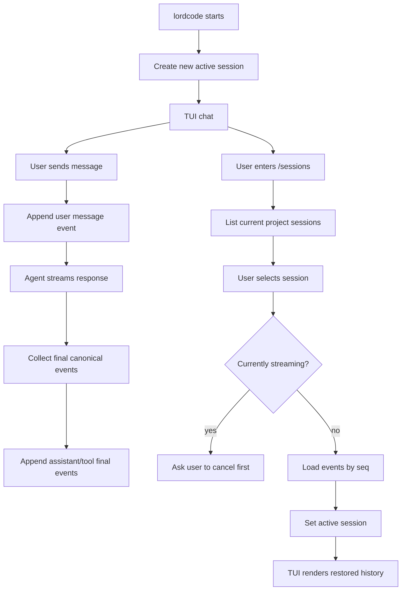

# Session Persistence — Design Spec

## Overview

This spec adds persistent user sessions to lordcode. A session is a recoverable conversation within one project, backed by SQLite and restored through the TUI.

Core design:

- Store sessions in a local SQLite database under the user data directory.
- Group sessions by project so `/sessions` only shows the current workspace by default.
- Persist only canonical final history: user messages, assistant final messages, final tool calls, tool results/errors, and selected system events.
- Do not persist streaming replay data such as assistant token deltas, tool input preparation progress, loading states, or other transient UI state.
- Let users open a TUI session picker with `/sessions` and choose the session to restore.

---

## Goals & Scope

### In Scope

- Add SQLite-backed storage for session metadata and canonical session events.
- Create a new session by default when lordcode starts.
- Auto-title a session from the first user message when no user title exists.
- List recent sessions for the current project.
- Restore a selected session from canonical history.
- Add `/sessions` as an interactive TUI picker for selecting a session.
- Add `/new` to create and switch to a fresh session.
- Add `/rename <title>` to set a user-controlled session title.
- Add migrations from the first version of the database schema.
- Preserve room for future JSONL export and richer trace history without implementing them now.

### Out of Scope

- Replaying historical streaming output.
- Persisting tool input preparation events.
- Persisting token-by-token assistant deltas.
- Full-text search across sessions.
- JSONL export UI/API.
- Cross-project session listing in the TUI.
- Automatic startup restore of the last session.
- Model-generated session titles.
- Multi-user or networked database support.

---

## Key Terms

### Canonical History

- Origin: "Canonical" means the source of truth used to resume the conversation.
- Definition: The minimal completed conversation state needed to continue an agent session.
- Usage: Canonical history includes final messages, final tool call inputs, and final tool results/errors. It excludes UI-only progress and streaming deltas.

### Trace History

- Origin: "Trace" means a detailed record of how a response unfolded over time.
- Definition: Optional debug/replay data such as token deltas or tool input preparation progress.
- Usage: Trace history is intentionally not implemented in this iteration. The schema should not block adding it later.

---

## User Experience

### Startup

By default, starting lordcode creates a new session for the current project. It does not automatically restore the last session because many coding-agent launches start a new task, and implicit restore can pollute context.

Future CLI flags may support explicit restore:

```bash
lordcode --last
lordcode --resume <session-id>
```

These flags are optional future work and are not required for this iteration.

### New Session Title

A new session starts with `title = NULL`. The TUI displays this as:

```text
Untitled session
```

After the first user message is appended, if the session has no user title, the server creates an automatic title from the first 40 characters of that user message, normalized for whitespace and truncated with `...` if needed.

Users can override the title with:

```text
/rename <title>
```

After a user rename, automatic title generation must not overwrite the title.

### Session Picker

The `/sessions` command opens an interactive picker for the current project.

Example:

```text
Sessions

> 实现用户 session 的持久化存储
  updated 3m ago · 12 messages · gpt-4o

  Tool input streaming design
  updated 2h ago · 27 messages · claude-sonnet

  Untitled session
  updated yesterday · 1 message · gpt-4o
```

Minimum required key bindings:

- `Up` / `Down`: move selection.
- `Enter`: restore the selected session.
- `Esc`: close the picker without switching.

Optional future key bindings:

- `j` / `k`: move selection.
- `d`: delete selected session with confirmation.
- `n`: create a new session.

### Restore Behavior

When the user selects a session:

1. If an assistant response is currently streaming, the TUI refuses to switch and asks the user to press `Esc` to cancel first.
2. The TUI requests the selected session from the server.
3. The server loads canonical events and sets the selected session as the active session.
4. The TUI replaces the visible conversation with the restored messages.
5. Future user input appends to the restored session.

The TUI may show a transient notice:

```text
Resumed session: <title>
```

This notice is UI-only and does not need to be persisted.

---

## Data Model

Use one SQLite database for all projects, stored under the lordcode user data directory:

```text
~/.lordcode/data/sessions.sqlite
```

### `sessions`

```sql
CREATE TABLE sessions (
  id TEXT PRIMARY KEY,
  project_id TEXT NOT NULL,
  project_path TEXT NOT NULL,
  title TEXT,
  title_source TEXT NOT NULL,
  model TEXT,
  status TEXT NOT NULL,
  created_at INTEGER NOT NULL,
  updated_at INTEGER NOT NULL
);

CREATE INDEX idx_sessions_project_updated
  ON sessions(project_id, updated_at DESC);
```

Field notes:

- `id`: stable session id.
- `project_id`: stable project key. Initial implementation can derive it from the normalized absolute project path, preferably hashed.
- `project_path`: readable absolute project path for display/debugging.
- `title`: nullable. `NULL` means the TUI shows `Untitled session`.
- `title_source`: `none`, `auto`, or `user`.
- `model`: model active when the session was created or last used.
- `status`: `active`, `idle`, or `archived` if archival is added later.
- `created_at` / `updated_at`: Unix milliseconds.

### `session_events`

```sql
CREATE TABLE session_events (
  id INTEGER PRIMARY KEY AUTOINCREMENT,
  session_id TEXT NOT NULL,
  seq INTEGER NOT NULL,
  type TEXT NOT NULL,
  role TEXT,
  payload TEXT NOT NULL,
  created_at INTEGER NOT NULL,
  FOREIGN KEY (session_id) REFERENCES sessions(id) ON DELETE CASCADE,
  UNIQUE (session_id, seq)
);

CREATE INDEX idx_session_events_session_seq
  ON session_events(session_id, seq);
```

Field notes:

- `seq`: monotonic event sequence within a session.
- `type`: `message`, `tool_call`, `tool_result`, or `system_event`.
- `role`: used for message events, usually `user`, `assistant`, or `system`.
- `payload`: JSON string containing the event-specific data.

### Event Payloads

User message:

```json
{
  "content": "帮我实现 session 持久化",
  "attachments": []
}
```

Assistant final message:

```json
{
  "content": "我会这样设计...",
  "finishReason": "stop",
  "usage": {
    "inputTokens": 1234,
    "outputTokens": 567
  }
}
```

Tool call:

```json
{
  "toolCallId": "call_123",
  "toolName": "read_file",
  "input": {
    "path": "packages/server/src/main.ts"
  }
}
```

Tool result:

```json
{
  "toolCallId": "call_123",
  "toolName": "read_file",
  "result": {
    "content": "..."
  },
  "isError": false
}
```

System event:

```json
{
  "message": "stream cancelled by user",
  "reason": "user_cancelled"
}
```

Payload JSON intentionally holds the more change-prone data. Query-critical fields stay in columns.

---

## Storage Behavior

### SQLite Initialization

Each database connection must enable:

```sql
PRAGMA journal_mode = WAL;
PRAGMA foreign_keys = ON;
PRAGMA busy_timeout = 5000;
```

Reasons:

- `WAL` improves local read/write behavior.
- `foreign_keys` enforces session/event integrity.
- `busy_timeout` avoids immediate failure on short-lived SQLite locks.

### Migrations

The first version must include a migration runner. Do not scatter `CREATE TABLE IF NOT EXISTS` across feature code.

```sql
CREATE TABLE schema_migrations (
  version INTEGER PRIMARY KEY,
  applied_at INTEGER NOT NULL
);
```

Startup flow:

1. Open the database.
2. Enable required PRAGMAs.
3. Ensure `schema_migrations` exists.
4. Read the current schema version.
5. Apply pending migrations in order.
6. Record each applied migration.

Each migration should run in a transaction where SQLite allows it.

### Event Append

Appending an event and updating the session timestamp must be atomic:

```sql
BEGIN;
INSERT INTO session_events (...);
UPDATE sessions SET updated_at = ? WHERE id = ?;
COMMIT;
```

If the appended event is the first user message and `title_source` is `none`, the same transaction should set the automatic title and change `title_source` to `auto`.

### Loading a Session

Restore canonical history by event order:

```sql
SELECT *
FROM session_events
WHERE session_id = ?
ORDER BY seq ASC;
```

The application layer converts records back into the conversation-history representation used by the agent and TUI.

### Listing Sessions

List current project sessions by recency:

```sql
SELECT *
FROM sessions
WHERE project_id = ?
ORDER BY updated_at DESC
LIMIT ?;
```

The picker also needs a message count. First implementation may compute it with a grouped query over `session_events`; if that becomes slow, add a denormalized count later.

---

## API Shape

The implementation should hide SQL behind a store interface, for example:

```ts
interface SessionStore {
  createSession(input: CreateSessionInput): Promise<SessionRecord>;
  appendEvent(sessionId: string, event: SessionEventInput): Promise<void>;
  listSessions(input: ListSessionsInput): Promise<SessionSummary[]>;
  loadSession(sessionId: string): Promise<LoadedSession>;
  renameSession(sessionId: string, title: string): Promise<SessionRecord>;
  deleteSession(sessionId: string): Promise<void>;
}
```

Shared/API types should expose the data needed by the TUI picker:

```ts
type SessionSummary = {
  id: string;
  title: string | null;
  titleSource: "none" | "auto" | "user";
  projectPath: string;
  updatedAt: number;
  messageCount: number;
  model: string | null;
};
```

The server should expose endpoints or equivalent internal API calls for:

- Create new active session.
- List current project sessions.
- Activate a selected session.
- Rename current session.

For active-session switching, prefer a command shaped around active state:

```http
POST /sessions/active
```

with:

```json
{
  "sessionId": "ses_..."
}
```

This expresses "switch the current active session" rather than mutating the session itself.

---

## Architecture Flow




---

## Error Handling

- If SQLite cannot open the database, surface a clear startup error with the database path.
- If migrations fail, stop using the database and surface the migration version that failed.
- If loading a selected session fails, keep the current active session unchanged.
- If a session does not belong to the current project, the picker should not show it. Direct activation should either reject it or require an explicit future cross-project mode.
- If a session switch is requested during streaming, refuse the switch and keep current state.
- If event JSON fails to parse during load, return a recoverable error rather than silently skipping the event.

---

## Non-Functional Requirements

### Performance

- Listing sessions should be indexed by `project_id, updated_at`.
- Loading a session should be indexed by `session_id, seq`.
- Do not persist token deltas or tool input progress, keeping database growth proportional to completed conversation history rather than streaming volume.

### Reliability

- SQLite transactions must protect event append plus session metadata update.
- `UNIQUE (session_id, seq)` must prevent duplicate event sequence numbers.
- `ON DELETE CASCADE` must prevent orphan events.

### Compatibility

- The schema must tolerate future payload changes by keeping event details in JSON.
- Migrations must exist from the first release of this feature.
- JSONL export can be added later by streaming `session_events` in `seq` order.
- Trace history can be added later as a separate table or by adding an event classification such as `canonical` vs `trace`.

### Privacy and Security

- Session data may contain source code, tool outputs, paths, and user prompts. Store it only in the local user data directory.
- Do not log full event payloads by default.
- Do not send persisted sessions to any external service except as normal model context when the user resumes and continues a session.

---

## Unit Test Strategy

### Session Store

- `UT-1` Given an empty database, when migrations run, then all required tables and indexes exist.
- `UT-2` Given a new session, when it is created, then it has `title = NULL` and `title_source = "none"`.
- `UT-3` Given a session with no title, when the first user message is appended, then the session receives an automatic truncated title.
- `UT-4` Given a user-renamed session, when later user messages are appended, then the title is not overwritten.
- `UT-5` Given multiple events, when they are appended, then their `seq` order is stable and unique.
- `UT-6` Given a session with events, when it is deleted, then related events are deleted.

### Session Loading

- `UT-7` Given a session with message, tool call, and tool result events, when it is loaded, then events are returned in `seq` order.
- `UT-8` Given malformed event payload JSON, when the session is loaded, then loading fails with a clear recoverable error.
- `UT-9` Given sessions from multiple projects, when listing sessions for one project, then only that project's sessions are returned.

### TUI Commands

- `UT-10` Given `/sessions`, when sessions exist, then the picker opens with current project sessions sorted by `updatedAt`.
- `UT-11` Given the picker is open, when `Enter` is pressed, then the selected session is activated and rendered.
- `UT-12` Given the picker is open, when `Esc` is pressed, then the picker closes without switching sessions.
- `UT-13` Given a response is streaming, when a session is selected, then the switch is refused and current session remains active.
- `UT-14` Given `/new`, when invoked, then a fresh active session is created.
- `UT-15` Given `/rename <title>`, when invoked, then the active session title becomes user-controlled.

---

## E2E Strategy

This is TUI-visible behavior, so no need for E2E testing after implementation.