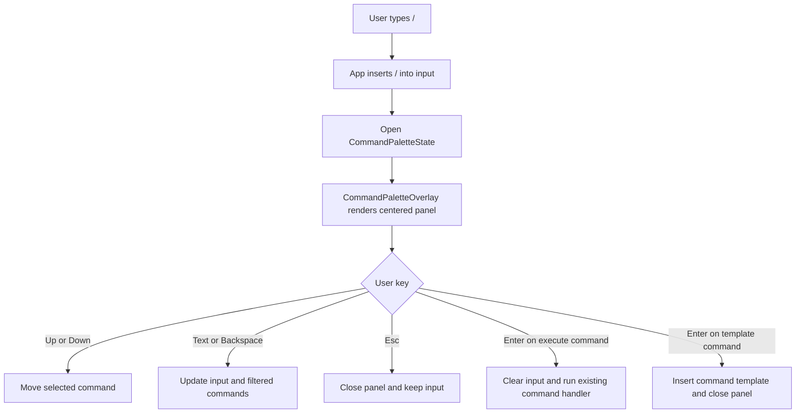

# Slash Command Palette — Design Spec

**Date**: 2026-05-21
**Status**: Draft
**Author**: Codex

## 0. Context & Goals

### Motivation

lordcode already supports slash commands such as `/models`, `/model <name>`, `/sessions`, `/new`, and `/rename <title>`.

Today the user has to remember those commands. This design adds a centered command panel that opens when the user types `/`. The panel shows available commands, lets the user move with Up and Down, and closes with Esc.

This design also prepares slash commands for future skill commands. A skill command is a slash command contributed by the skill system rather than hard-coded as a built-in command.

### Goals

- [ ] Goal G1 (Make existing slash commands discoverable while the user types).
- [ ] Goal G2 (Keep one command list as the source for parsing, display, filtering, and completion).
- [ ] Goal G3 (Render the command panel centered above the rest of the TUI without moving chat content).
- [ ] Goal G4 (Support future skill commands through the same command panel contract).
- [ ] Goal G5 (Keep command behavior testable with pure state helpers).

### Non-goals

- Implementing the skill runner.
- Loading skill commands from disk or server in this iteration.
- Changing the behavior of existing commands after Enter.
- Adding fuzzy search beyond simple prefix or substring filtering.
- Adding mouse support.

## 1. Top-level Design Decisions

### Architecture

The feature has three layers:

- A command metadata layer in `lib/commands.ts`.
- A pure command panel state layer in `lib/command-palette.ts`.
- A centered overlay view in `components/App.tsx` or a nearby component file.

The command panel reads command metadata. It does not know how commands are executed. The existing submit path still parses the final input and calls the same handlers as today.

The term command metadata means the shared data that describes a slash command: name, usage, description, command source, and argument behavior. The name is chosen because the data describes commands without executing them. In this design it is used by the parser, panel, and future skill command source.

### Components

| Component | Responsibility |
|-----------|----------------|
| `COMMAND_DEFINITIONS` | Holds built-in command metadata for `/models`, `/model <name>`, `/sessions`, `/new`, and `/rename <title>`. |
| `parseCommand` | Parses submitted input into the existing command result shape. |
| `command-palette.ts` | Opens, closes, filters, selects, and completes command panel state. |
| `CommandPaletteOverlay` | Renders the centered panel above the rest of the TUI. |
| `App.useInput` | Routes keys to streaming cancel, session picker, command panel, or normal input editing. |
| Future skill command source | Converts available skills into the same command metadata shape. |

### Interfaces

| Interface | From | To | Protocol / Contract |
|-----------|------|----|---------------------|
| `SlashCommandDefinition` | `commands.ts` | parser and command panel | Plain object with `name`, `usage`, `description`, `source`, and `completion` fields. |
| `CommandPaletteState` | `command-palette.ts` | `App` and overlay | Plain state with query text, filtered commands, selected index, and open/closed state. |
| `CommandPaletteAction` | command panel | `App` | Enter returns either `execute` for complete commands or `complete-input` for commands that need arguments. |
| Future skill command source | skill system | command metadata layer | Returns extra `SlashCommandDefinition[]` with `source: "skill"`. |

### Data Model

```ts
export type SlashCommandSource = "builtin" | "skill";

export interface SlashCommandDefinition {
  name: string;
  usage: string;
  description: string;
  source: SlashCommandSource;
  completion: "execute" | "insert-template";
  template: string;
}
```

Initial built-in commands:

| Command | Description | Completion |
|---------|-------------|------------|
| `/models` | List configured models. | `execute` |
| `/model <name>` | Switch current model. | `insert-template` with `/model ` |
| `/sessions` | Show sessions for the current project. | `execute` |
| `/new` | Start a new session. | `execute` |
| `/rename <title>` | Rename the current session. | `insert-template` with `/rename ` |

### Flow Diagram



### Directory Tree

```markdown
lordcode/
├── packages/
│   └── tui/
│       └── src/
│           ├── components/
│           │   ├── App.tsx
│           │   └── input/
│           │       └── Input.tsx
│           └── lib/
│               ├── command-palette.ts
│               ├── command-palette.test.ts
│               ├── commands.ts
│               └── commands.test.ts
└── harness-kit/
    └── specs/
        └── slash-command-palette-2026_05_21/
            ├── design.md
            └── test-category.md
```

## 2. Constraints & Assumptions

### Technical Constraints

| Constraint | Impact | Mitigation |
|------------|--------|------------|
| The TUI uses Ink 7. | The overlay must use Ink layout primitives. | Use `position="absolute"` and render the overlay after normal content. |
| Input editing already lives in `input-buffer.ts`. | Command panel must not duplicate cursor editing rules. | Reuse existing input state and transitions. |
| Existing commands are parsed by `parseCommand`. | New UI must not fork execution behavior. | Submit complete commands through the existing command path. |
| The session picker already owns Up, Down, Enter, and Esc when open. | Modal states can conflict. | Keep session picker and command panel mutually exclusive. |

### Business Constraints

| Constraint | Impact |
|------------|--------|
| The feature is local TUI behavior. | No server API is required for the first iteration. |
| Future skill commands are expected. | Command metadata must allow commands not known at compile time. |

### Assumptions

| Assumption | Risk if Invalidated |
|------------|---------------------|
| Typing `/` at the start of the input should open the panel. | If users expect `/` inside text to open it, the panel may feel inconsistent. |
| Esc should close the panel and keep the input. | If users expect Esc to clear `/`, extra delete key presses may be needed. |
| Commands that need arguments should insert a template instead of executing. | If users expect a secondary form, template completion may feel minimal. |
| Future skill commands can be represented as slash commands with name, usage, and description. | More complex skill inputs may need richer metadata later. |

## 3. Detailed Design

### Module: `commands.ts`

**Responsibility**: Own built-in command metadata and parse submitted command text.

**Mechanism**:

- Export `COMMAND_DEFINITIONS`.
- Keep existing `Command` result types.
- Update `parseCommand` to consult command metadata where it improves sharing.
- Keep explicit argument parsing for commands with special behavior, such as `/model <name>` and `/rename <title>`.
- Preserve current command behavior:
  - Extra tokens for `/models` are ignored.
  - `/model` without a name is invalid.
  - `/rename` without a title is invalid.
  - Command names remain case-sensitive.

**Dependencies**: None.

### Module: `command-palette.ts`

**Responsibility**: Provide pure state transitions for the command panel.

**Mechanism**:

- `openCommandPalette(input, commands)` creates panel state from current input.
- `filterCommandPalette(state, input)` derives visible commands from input after the leading `/`.
- Filtering should match command `name`, `usage`, and optionally `description`.
- `moveCommandPaletteSelection(state, delta)` clamps selection to the visible command list.
- `closeCommandPalette(state)` returns `null`.
- `activateSelectedCommand(state)` returns:
  - `{ kind: "execute", input: "/models" }` for commands with `completion: "execute"`.
  - `{ kind: "complete-input", input: "/model " }` for commands with `completion: "insert-template"`.
  - `{ kind: "none" }` when no command is selected.

**Dependencies**: `SlashCommandDefinition` from `commands.ts`.

### Module: `CommandPaletteOverlay`

**Responsibility**: Render the command panel centered above the TUI.

**Mechanism**:

- Render only when `commandPalette != null`.
- Use an absolute full-screen Box as the overlay root.
- Center a bounded-width panel with title, current query, command rows, and key hints.
- Render after normal app content so it appears above it.
- Use the same visual language as `SessionPickerView`: `> ` for selected row, cyan for selected command, dim text for descriptions and hints.
- Do not permanently add rows to chat history.

**Dependencies**: Ink `Box`, `Text`, `useStdout`, and `CommandPaletteState`.

### Module: `App.useInput`

**Responsibility**: Route keys to the active interaction mode.

**Mechanism**:

- Keep Ctrl-C and Ctrl-D as global exit keys.
- If streaming is active, Esc cancels streaming and no command panel is shown.
- If the session picker is open, keep its current key behavior.
- If the command panel is open:
  - Esc closes the panel and keeps input.
  - Up and Down move the selected command.
  - Enter activates the selected command.
  - Backspace and normal text edit the shared input and refresh visible commands.
- If no panel is open:
  - Typing `/` at input start inserts `/` and opens the command panel.
  - Other input editing stays unchanged.

**Dependencies**: `input-buffer.ts`, `command-palette.ts`, `parseCommand`, and existing command handlers.

### Module: Future skill command source

**Responsibility**: Convert available skills into command metadata.

**Mechanism**:

- The first iteration can keep this as a seam in code, not a working loader.
- Later, a loader can return `SlashCommandDefinition[]` with `source: "skill"`.
- The command panel should accept `allCommands = [...builtinCommands, ...skillCommands]`.
- Skill command execution should be handled after parsing, not inside the overlay.

**Dependencies**: Future skill registry or server API.

### Error Handling Strategy

| Error Category | Example | Handling | User-facing Behavior |
|----------------|---------|----------|----------------------|
| Empty command list | No built-in or skill commands are available. | Render an empty state. | Panel shows `No commands`. |
| No filtered results | User types `/zzz`. | Keep panel open. | Panel shows `No matching commands`. |
| Invalid submitted command | User presses Enter on malformed input. | Existing `parseCommand` returns invalid. | Existing system error is shown. |
| Command execution failure | `/models` API call fails. | Existing handler logs and pushes a system error. | User sees the existing error message. |

### Configuration Management

| Key | Type | Default | Source | Description |
|-----|------|---------|--------|-------------|
| `COMMAND_DEFINITIONS` | const array | built-in commands | source code | Built-in commands shown and parsed by the TUI. |
| `skillCommands` | array | empty array | future runtime source | Future skill-provided commands merged into the panel. |
| `COMMAND_PALETTE_MAX_ROWS` | number | 8 | source code | Maximum visible command rows before clipping or scrolling is added. |

## 4. Non-functional Requirements

### Performance

| Metric | Target | Measurement Method |
|--------|--------|--------------------|
| Panel open latency | Under one render tick after typing `/`. | Ink component test or manual TUI check. |
| Filtering latency | Under 16ms for 100 commands. | Unit test or benchmark for `filterCommandPalette`. |
| Memory use | Small array copies only. | Code review and unit test with sample command lists. |

### Security

The command panel only displays metadata and edits local input. It must not execute a skill or built-in command until the user presses Enter. Future skill descriptions should be treated as plain text.

### Reliability

The panel should close without side effects on Esc. If filtering fails to find a command, the user can keep typing or submit the raw command to the existing parser.

### Observability

| Signal | Tool / Format | What is Captured |
|--------|---------------|------------------|
| Logs | existing logger | Panel open, command activation, and invalid command activation. |
| Metrics | none | Not required for this local TUI feature. |
| Traces | none | Not required for this local TUI feature. |

### Compatibility

Existing slash commands keep their submitted text behavior. Users can still type a full command manually and press Enter. The command panel adds discovery and completion without requiring a migration.

## 5. Test Category

Refer to `harness-kit/specs/slash-command-palette-2026_05_21/test-category.md`.

## Glossary

### Skill command

- **Origin**: The project already uses the word skill for reusable agent capabilities.
- **Definition**: A slash command contributed by the skill system instead of being built into `commands.ts`.
- **Usage in this design**: Skill commands share the same command metadata shape as built-in commands so the panel does not need separate UI logic.
- **Scope**: Goals, data model, `Future skill command source`.
- **Example**: A future `/review` command could appear beside `/models` with `source: "skill"`.
