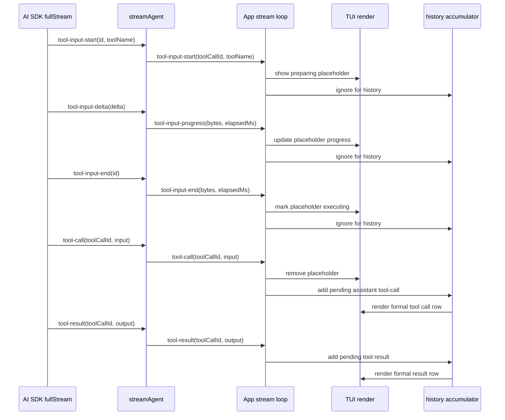

# Tool Input Streaming — Design Spec

## Overview

This spec adds early TUI visibility for tool calls while the model is still streaming tool input JSON through Vercel AI SDK `fullStream`.

Today the server observes SDK `tool-input-start` / `tool-input-delta` / `tool-input-end` chunks, but only logs them. The TUI does not show anything until the later `tool-call` event arrives, which happens only after the complete tool input is available. For small tools this gap is negligible. For large-input tools such as `write_file`, the gap can make the agent look stuck even though the model is actively preparing a tool call.

Core design:

- Add three SSE events: `tool-input-start`, `tool-input-progress`, and `tool-input-end`.
- Treat these events as **UI-only lifecycle events**. They must not enter `ModelMessage[]` history.
- Render a temporary TUI row during input preparation, then replace it with the existing formal tool call row once `tool-call` arrives.
- Keep `tool-result` / `tool-error` rendering unchanged: results are appended only after the tool actually completes.

---

## Goals & Scope

### In Scope

- Extend `AgentStreamEvent` with tool input lifecycle events.
- Forward throttled tool input progress from `streamAgent`.
- Add TUI live state for in-flight tool input preparation.
- Render visible progress before the formal `tool-call` event.
- Preserve current conversation-history invariants:
  - `ModelMessage[]` remains the canonical history.
  - Only `tool-call`, `tool-result`, and `tool-error` affect tool history.
  - `tool-input-*` events are never sent back to the provider on later turns.
- Add focused unit tests around stream forwarding, accumulation, and rendering projection.

### Out of Scope

- Streaming raw tool input deltas to the TUI.
- Showing full tool arguments before `tool-call`; the complete parsed input is not available until `tool-call`.
- Changing tool execution semantics.
- Adding approval flows or cancellation UI for tools.
- Persisting tool input progress across turns.

---

## Current Behavior

### Server

`packages/server/src/agent/stream.ts` consumes AI SDK `fullStream` chunks:

```text
tool-input-start  -> log only
tool-input-delta  -> log throttled progress only
tool-input-end    -> log only
tool-call         -> yield AgentStreamEvent { type: "tool-call", input }
tool-result       -> yield AgentStreamEvent { type: "tool-result", output }
tool-error        -> yield AgentStreamEvent { type: "tool-error", message }
```

This means the TUI sees nothing during model-side argument generation.

### TUI

The TUI currently derives visible tool rows from canonical history plus pending assistant/tool messages:

```text
SSE AgentStreamEvent
  -> history-accumulator
  -> snapshotForRender()
  -> deriveEntries()
  -> ToolEntryView
```

`ToolEntryView` supports:

- `phase = "call"`: `-> tool(args)` while waiting for result.
- `phase = "result"`: `-> tool(args)` plus `<- result`.
- `phase = "error"`: `-> tool(args)` plus `x error`.

This works once `tool-call` has arrived, but cannot show the earlier `tool-input-*` period.

---

## Proposed Event Contract

Add three UI-only event variants to `AgentStreamEvent` in `packages/shared/src/api.ts`:

```ts
| {
    type: "tool-input-start";
    toolCallId: string;
    toolName: string;
  }
| {
    type: "tool-input-progress";
    toolCallId: string;
    toolName: string;
    inputBytes: number;
    elapsedMs: number;
  }
| {
    type: "tool-input-end";
    toolCallId: string;
    toolName: string;
    inputBytes: number;
    elapsedMs: number;
  }
```

### Naming

Use `toolCallId` on the wire, even though SDK `tool-input-*` chunks expose the identifier as `id` in this code path. This keeps all tool-related `AgentStreamEvent` variants consistent for TUI consumers.

### Payload Rules

- `tool-input-start` contains only identity: `toolCallId`, `toolName`.
- `tool-input-progress` contains aggregate progress, not raw deltas.
- `tool-input-end` contains final aggregate bytes and elapsed time for the input-generation phase.
- No event includes the raw JSON argument delta.

### Compatibility

This is an internal TUI/server protocol change. Existing clients that switch exhaustively on `AgentStreamEvent.type` will need to ignore or handle the new variants. The TUI accumulator must explicitly ignore these events for history.

---

## State Machine

For each tool call id:

```text
tool-input-start
  -> preparing input

tool-input-progress
  -> preparing input with byte count

tool-input-end
  -> executing / waiting for formal tool-call

tool-call
  -> formal call row with parsed input

tool-result
  -> completed result row

tool-error
  -> errored result row
```

Important distinction:

- `tool-input-end` does **not** mean the tool has completed.
- `tool-input-end` only means the model finished producing the input JSON.
- The real result can only be shown after `tool-result` or `tool-error`.

---

## Server Design

### Stream Forwarding

Update `packages/server/src/agent/stream.ts`:

- On SDK `tool-input-start`:
  - Create/reset the existing `ToolInputProgress` entry.
  - Yield `AgentStreamEvent { type: "tool-input-start", toolCallId, toolName }`.
- On SDK `tool-input-delta`:
  - Continue accumulating byte length.
  - When the existing throttle threshold fires, yield `tool-input-progress`.
  - Keep existing debug logging.
- On SDK `tool-input-end`:
  - Yield `tool-input-end` with final byte count and elapsed time.
  - Delete the progress entry.
  - Keep existing debug logging.

### Throttling

Reuse the existing thresholds:

- `TOOL_INPUT_LOG_INTERVAL_MS = 1000`
- `TOOL_INPUT_LOG_BYTES = 64 * 1024`

These thresholds become "log and UI progress" thresholds. `tool-input-start` and `tool-input-end` are always emitted; `tool-input-progress` is throttled.

### Missing State

If a `tool-input-delta` or `tool-input-end` arrives without a known progress entry:

- Log as today.
- Do not throw.
- For `tool-input-end`, emit a best-effort event only if `toolName` is available from the chunk or can be recovered. Otherwise skip the UI event to avoid rendering an anonymous placeholder.

---

## TUI Design

### Keep History Pure

Update `packages/tui/src/lib/history-accumulator.ts`:

- `accumulate()` must ignore `tool-input-start`, `tool-input-progress`, and `tool-input-end`.
- These events do not flush pending assistant or pending tool state.
- `snapshotForRender()` remains focused on canonical `ModelMessage[]` plus valid in-flight assistant/tool messages.

This preserves the provider-facing conversation shape.

### Live Tool Input State

Add TUI-local live state, likely inside `StreamingState` in `packages/tui/src/components/App.tsx`:

```ts
interface LiveToolInput {
  toolCallId: string;
  toolName: string;
  phase: "preparing" | "executing";
  inputBytes?: number;
  elapsedMs?: number;
}
```

`StreamingState` should carry:

```ts
toolInputs: LiveToolInput[];
```

This state is reset when a new stream starts or finishes, and dropped on errors/abort along with other streaming-only UI state.

### Event Handling

In the stream loop:

- `tool-input-start`:
  - Upsert `LiveToolInput` with `phase: "preparing"`.
  - Close any active reasoning block if needed for visual clarity.
  - Update streaming state.
- `tool-input-progress`:
  - Upsert byte/elapsed progress.
  - Keep `phase: "preparing"`.
- `tool-input-end`:
  - Upsert the entry with final byte/elapsed values.
  - Set `phase: "executing"`.
- `tool-call`:
  - Remove the matching live tool input placeholder.
  - Keep the existing accumulator-driven formal tool call rendering.
  - Keep the existing visual reset of streaming text so later text starts below the tool call.
- `tool-result` / `tool-error`:
  - No direct live-input change should be necessary, because the matching placeholder should already be gone after `tool-call`.
  - As a defensive cleanup, remove any placeholder with the matching `toolCallId`.

### Render Placement

Render live tool input placeholders in the streaming overlay after reasoning and live assistant text:

```text
Thought for ...
ai · current text▌
-> write_file preparing input... 128 KB
```

Once `tool-call` arrives, the formal row appears through `deriveEntries()`:

```text
-> write_file(path: "src/example.ts")
<- overwrote · 2.1 KB
```

The placeholder should disappear when the formal row appears.

### Formatting

Add a small formatter, either in `format-tool-call.ts` or alongside `ToolEntryView`:

```text
-> write_file preparing input...
-> write_file preparing input... 128 KB
-> write_file executing...
```

Rules:

- Use `toolName` only before `tool-call`, because full arguments are unavailable.
- Show bytes only after progress/end provides a byte count.
- Use existing `humanBytes` style for byte formatting if possible.
- Keep color dim cyan to visually connect it to tools without implying the tool has completed.

---

## UX Details

### Short Tools

For tools with tiny inputs (`glob`, `read_file`, most `ripgrep` calls), the placeholder may appear briefly. Initial implementation should accept this. If flicker becomes distracting, add a later display threshold such as "show only after 300ms or first progress event".

### Large Tools

For `write_file`, users should see immediate activity even while the model is still streaming the file content as JSON input:

```text
-> write_file preparing input...
-> write_file preparing input... 64 KB
-> write_file preparing input... 128 KB
-> write_file executing...
```

Then the formal call/result rows take over.

### Error Cases

If a provider emits `tool-input-start` but the turn errors before `tool-call`, the placeholder should disappear when `streaming` is cleared and the normal error system note is shown.

If an abort happens during input preparation, the placeholder should disappear with the rest of streaming state. Nothing should be flushed to history.

---

## Data Flow



---

## Target Files

```text
packages/shared/src/api.ts
  - Add AgentStreamEvent variants for tool-input-start/progress/end.

packages/server/src/agent/stream.ts
  - Yield UI events while consuming SDK tool-input chunks.
  - Reuse existing progress accumulator and throttle thresholds.

packages/server/src/agent/stream.test.ts
  - Cover start/progress/end forwarding and throttling behavior.

packages/tui/src/lib/history-accumulator.ts
  - Ignore new UI-only events.

packages/tui/src/lib/history-accumulator.test.ts
  - Assert tool-input events do not mutate history or pending state.

packages/tui/src/lib/chat-entries.ts
  - Optional: add a LiveToolInput UI type if keeping shared entry types.

packages/tui/src/lib/format-tool-call.ts
  - Add formatting helper for live tool input placeholders.

packages/tui/src/components/App.tsx
  - Track live tool input state in StreamingState.
  - Handle new stream events.
  - Render live placeholders in the streaming overlay.

packages/tui/src/lib/format-tool-call.test.ts
  - Cover placeholder formatting.
```

---

## Test Strategy

### Server Unit Tests

`UT-S1`: Given a `fullStream` with `tool-input-start`, when `streamAgent` consumes it, then it yields `tool-input-start` with `toolCallId` mapped from SDK `id`.

`UT-S2`: Given multiple `tool-input-delta` chunks below throttle thresholds, when streamed, then no `tool-input-progress` is yielded before threshold.

`UT-S3`: Given deltas crossing the byte threshold, when streamed, then `tool-input-progress` is yielded with aggregate `inputBytes` and `elapsedMs`.

`UT-S4`: Given `tool-input-end` after deltas, when streamed, then `tool-input-end` is yielded with final aggregate bytes and the progress state is cleared.

`UT-S5`: Given the normal sequence `tool-input-start -> tool-input-end -> tool-call -> tool-result`, then emitted events preserve that order.

### TUI Accumulator Tests

`UT-A1`: Given `tool-input-start/progress/end`, when passed to `accumulate()`, then history and pending state are unchanged.

`UT-A2`: Given assistant text followed by `tool-input-*`, then `tool-call`, when accumulated, then text is not flushed until the formal `tool-call` path requires it.

### TUI Rendering / State Tests

`UT-T1`: Given `tool-input-start`, TUI live state contains a preparing placeholder.

`UT-T2`: Given `tool-input-progress`, the placeholder updates aggregate bytes and elapsed time.

`UT-T3`: Given `tool-input-end`, the placeholder phase becomes `executing`.

`UT-T4`: Given `tool-call` for the same id, the placeholder is removed and formal `ToolEntryView` renders through existing history projection.

`UT-T5`: Given `tool-result` without a prior cleanup, the matching placeholder is defensively removed.

### Manual Verification

Run a prompt that triggers a large `write_file` call. Expected TUI behavior:

1. A preparing row appears quickly.
2. Progress updates appear at throttled intervals or byte thresholds.
3. The row changes to executing after input generation ends.
4. The formal `write_file(path: ...)` call row replaces the placeholder.
5. The result row appears after the write completes.

---

## Open Decisions

1. **Flicker threshold**: Start with immediate rendering for all tools. Revisit if short tool calls flicker noticeably.
2. **Progress wording**: Use "preparing input" for model-side argument generation and "executing" after input end. This avoids implying the tool ran before it actually did.
3. **Formatter location**: Prefer `format-tool-call.ts` if the live placeholder formatter can reuse byte formatting; otherwise keep a small local formatter in `App.tsx` and extract later.
